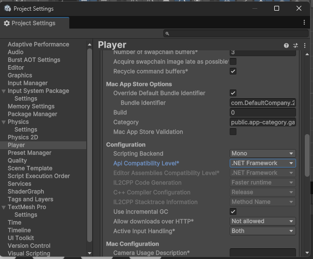

# Pong com Unity e Arduino
O projeto teve como objetivo criar um jogo simples que pudesse ser interagido com os módulos do Arduino: um módulo com 2 push button e um módulo com 4 LEDs.

Os botões movem a raquete (cima e baixo) e os LEDs para exibir o placar, o jogo encerra quando o algum jogador fizer 2 pontos.

## 1. Porta Serial
A comunicação entre o Arduino e jogo no Unity é realizado pela porta serial. Veja a seguir as especificações em cada um dos casos.

### 1.1. Arduino para Unity
O Arduino envia para o Unity o estado dos botões, quando pressionados será 1 e quando soltos será 0.
O conteúdo enviado pela porta serial será um texto com os estados dos botões separados por ponto-e-vírgula (;), sendo o primeiro valor o botão da esquerda. O conteúdo enviado na porta serial é encerrada com quebra-de-linha (\n).

Amostra dos conteúdos que serão enviados pela porta serial:
a. Quando ambos botões não são pressionados o conteúdo será “0;0\n”
b. Se somente o botão esquerdo é pressionado o conteúdo será “1;0\n”
c. Se somente o botão direito pressionado o conteúdo será “0;1\n”

Obs. É permitido que ambos os botões sejam pressionados e nesse caso o conteúdo será “1;1\n”, porém, para essa aplicação, terá o mesmo efeito que o caso ª

### 1.2. Unity para Arduino
Semelhante ao modelo anterior, o Unity envia para o Arduino os estados de cada LED, sendo 1 para acesso e 0 para desligado.

O conteúdo enviado pela porta serial será um texto com os estados dos LEDs separados por ponto-e-vírgula (;). O conteúdo enviado na porta serial é encerrada com quebra-de-linha (\n).

Nessa aplicação os LEDs são divididos entre os jogadores, os dois LEDs da esquerda para os pontos do jogador da esquerda e os outros para o jogador da direita. Veja um exemplo do conteúdo transmitido em alguns casos:

    a. Quando o placar for 0x0 o conteúdo será “0;0;0;0\n”
    b. Quando o placar for 1x0 o conteúdo será “1;0;0;0\n”
    c. Quando o placar for 2x1 o conteúdo será “1;1;0;1\n”

---

## 2. Arduino
Pinagem
- Os pinos utilizados pelos botões são os 10 (esquerdo) e 11 (direito);
- Os pinos utilizados pelos LEDs são os 6, 7, 8 e 9.

No setup a porta serial deverá ser iniciado com a taxa de transferência igual a 19200, os pinos dos botões deverão ser configurados como INPUT_PULLUP e os pinos dos LEDs como OUTPUT.

<!-- No final do loop há delay de 5 milissegundos para evitar que ocorra sobrecarga na aplicação do Unity. Nos testes que não havia esse controle a aplicação no Unity apresentava lentidão. -->

Foi implementado 3 métodos: writeSerialPort, readSerialPort e setLeds.

### 2.1. writeSerialPort( int btnL, int btnR )
Esse método é responsável por escrever na porta serial o estado dos botões com descrito na sessão 1.1. Arduino para Unity.
Esse método recebe dois parâmetros do tipo int informado o estado dos botões que serão escritos na porta serial.

### 2.2. readSerialPort()
Esse método é responsável por ler a porta serial como descrito na sessão 1.2. Unity para Arduino.
Após interpretar o conteúdo da porta serial, o método setLeds é chamado para alterar o estado dos LEDs.

### 2.3. setLeds( int values[] )
Esse método é responsável por alterar os valores dos LEDs. Recebe como argumento um array do tipo int, em que cada item representa o estado de um LED: acesso (1) ou apagado (0).

---

## 3. Unity

A cena está estruturada da seguinte maneira:

- Field contém WallTop e WallBottom (retângulos superior e inferior), o GoalLeft e GoalRight cada um com sua tag para identificar a colisão);
- HudCanvas é a UI para exibir o placar e a configuração da porta COM (SerialPort)
- ManagerCanvas é UI para mensagens de fim de gameplay;
- PlayerLeft e PlayerRight são as raquetes, o PlayerLeft é controlado pelo jogador;
- Ball é objeto que representa a bola;
- GameManager contém o Script responsável por gerenciar a gameplay e a comunicação com a porta serial.

Veja a seguir os scripts que foram adicionados em cada objeto. Eles se encontram em [Pong/Assets/Scripts/](Pong/Assets/Scripts/).

### 3.1. PlayerLeft.cs

Componente adicionado ao objeto PlayerLeft (lado do jogador), possui os métodos públicos moveUp() e moveDown() para controlar a posição do objeto. 

Para caso não haja comunicação com a porta serial, possui os controles de movimentação com as teclas Z e X do teclado (Simulando os botões esquerdo e direito do módulo ligado ao Arduino).

### 3.2. PlayerRight.cs

Componente adicionado ao objeto PlayerRight simula o comportamento de um jogador oponente.

### 3.3. BallController.cs

Componente adicionado ao objeto da bola, é responsável por controlar a posição, movimentação e as colisões. Possui dois métodos públicos reset() e startMove() dos quais reiniciam a posição e inicia a movimentação.

### 3.4. GameManager.cs

Componente adicionado ao objeto vazio GameManager, é responsável pelo gerenciamento da gameplay e comunicação com a porta serial.

Para que o Unity tenha suporte ao recurso de ler porta serial (System.IO.Ports), é preciso definir a API Compatibility Level como .NET Framework. Essa configuração pode ser alterada acessando Edit > Project Settings > Player.

A comunicação com uma porta serial inicia quando o jogador pressionar uma das teclas numéricas (acima do teclado), a porta será iniciada chamando o método startSerialPort, a porta COM será referente a tecla pressionada (3 a 9).

Os métodos que realizam o gerenciamento do estado do jogo são prepareGame (inicia jogo com contagem regressiva), startGame (inicia nova partida imediatamente, quando um jogador pontuar) e endGame (para as execuções, ocorre quando a pontuação do jogador for igual a 2).

Quando um jogador pontuar, o método updateScoreboard é invocado para atualizar a pontuação do HUD e envia o estado dos LEDs pela porta serial se estiver aberta, essa operação é realizada pelo método setLEDValues.

O método startSerialPort inicia a coroutine ReadSerialPort, que realizará a leitura da porta serial aberta periodicamente e quando houver informação dos botões invocará o método onArduinoReceive que ira realizar a movimentação da raquete esquerda.

